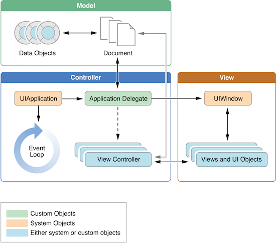
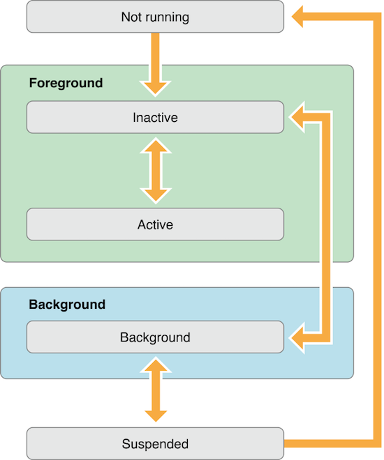

# The App Life Cycle

iOS App은 MVC 모델에 기초하여 앱을 구성한다. 그 구성엔 시스템 구조와 개발자의 code를 포함한다.

### The Main Function

iOS앱은 main function을 기초로 시작된다. 이는 xcode 자체적으로 작성되며, 추가적인 개별화는 필요시에만 권장된다.

```
# import <UIKit/UIKit.h>
# import "AppDelegate.h"

int main(int argc, char * argv[])
{
	@autoreleasepool {
    	return UIApplicationMain(argc, argv, nil, NSStringFromClass([AppDelegate class]));
	}
}

```

main 함수는 UIKit에 대한 접근을 담당하며, UIApplicationMain은 App의 주된 기능과 UI 구성, 개발자의 custom code호출을 담당한다. 그리고 App을 main run loop로 전환한다.


## The Structure of an App

UIApplicationMain은 앱 실행에 필요한 주된 값들을 설정한다. 다음 그림(2-1)은 각 object들의 앱 내에서 역할을 표현하며 이 구조는 다양한 환경에서의 앱 실행을 보장한다.




- **UIApplication object** - 여러 event loop와 높은 level의 실행을 담당한다. 주된 transitions 과 특별한 event를 구성한다.
- **App delegate object** - 개발자가 작성한 코드의 핵심이다. App의 고유한 객체이며 높은 수준의 event와 DS를 표현한다.

- **Documents and data model objects** - App의 content를 저장한다. App마다 지정된 다양한 형태의 data를 의미하며 효율적인 data관리를 위하여 권장된다. 

- **View controller objects** - App Screen에서 표현되는 내용을 담는다. App의 단일 View와 그 하위 View들을 의미하여, 이 View들을 Window에 표현되도록 한다. 다양한 형태의 View controller를 통하여 Picker, tab bar, navigation 을 구현할 수 있다.

- **UIWindow object** - view들이 App 상에서 표현되도록 하는 역할을 담당한다. 보통 하나의 Window를 가지며, 추가적인 Window를 통하여 외부 출력을 구현할 수 있다. 

- **View objects, control objects, and layer objects** - View 객체는 단순한 사각 형태의 표현과 개발자의 custom한 표현을 담당하며, Control 객체를 통하여 button, text field를 구현할 수 있다.


추가적으로, Core Animation의 layer 객체를 통하여 시각적인 기능을 구현할 수 있다.


## The Main Run Loop

App의 Main run loop는 사용자의 event를 처리한다. 이 작업은 Main thread에서 진행되며, 사용자의 event를 순차적으로 처리한다. 앱 내에서의 user interaction은 순차적으로 Port를 통하여 Event queue에 저장된다. UIApplication 객체는 이러한 event를 처리하는 최우선 객체이며, 일반적인 touch event는 window object로 할당된다. 

App에는 다양한 event가 전달될 수 있으며, event는 아래 표에 정리된다.


| Event                                    | Notes                                    |
| ---------------------------------------- | ---------------------------------------- |
| **Touch**                                | View는  Touch event에 응답한다. 처리되지 않을 경우 responder chain을 따라 처리된다. |
| **Remote control, Shake motion events**  | headphone과 accessories에 의해 발생하는 event이다. |
| **Accelerometer, Magnetometer,Gyroscope** | Accelerometer, Magnetometer,Gyroscope 에 해당하는 event는 개발자가 지정한 객체에 할당된다. |
| **Location**                             | Core Location Framework를 통하여 처리된다.       |
| Redraw                                   | view자체에서 draw를 호출한다.                     |


## Execution States for Apps

App은 항상 다음에서 정의된 상태를 가진다. 이 상태를 actions들에 의하여 변경된다.



- **Not running** - 실행되지 않았거나, system에 의해 종료된 상태를 의미한다.

- **Inactive** - foreground에서 실행중이지만 특별한 event를 받지 않는 상태를 의미한다.

- **Active** - foreground에서 실행 중 이며, event를 처리중인 상태를 의미한다.

- **Background** - App이 background에서 지정된 code를 실행중인 상태를 의미한다. 

- **Suspended** - App이 background에서 특별한 code실행 없이 대기중인 상태를 의미한다. memory가 부족한 상황에선 이 상태의 App를 종료시키기도 한다.

  ​

다음 method들은 각 상태 변화시에 호출된다.


- **application:willFinishLaunchingWithOptions:** - 최초 실행 시 호출된다.

- **application:didFinishLaunchingWithOptions:** - 기기에서 표시되기 전 호출된다. 유저에게 표시되기 전 객체 초기회가 가능하다.

- **applicationDidBecomeActive:** - App이 foreground로 진입한다.

- **applicationWillResignActive:** - foreground 상태에서의 탈출 시에 호출된다.

- **applicationDidEnterBackground:** - App이 background 진입 시 호출된다.

- **applicationWillEnterForeground:** - App이 background에서 foreground진입 시 호출된다.

- **applicationWillTerminate:** - App이 terminated시 호출된다.

  ​

## App Termination

App을 terminate 시키는건 시스템의 자연스러운 과정이기 때문에, 데이터를 저장, 작업 수행은 사전에 이루어져야 한다. 

Memory 상황에 따라 Suspend 상태의 App은 임의로 terminate가 이루어 진다.


## Threads and Concurrency

개발자는 필요한 여러 thread를 생성할 수 있으며, 기본적으로 System에서는 main thread를 제공한다. 
GCD, Opreation object, 비동기 실행을 활용하여 iOS에서의 병렬 처리가 가능하다.
System에 다중 thread처리를 맡김으로서, 개발자가 원하는 코드생성과 thread 관리를 편하게 할 수 있다.

**Note**

> View관련 작업, Animation 등은 main thread에서 이루어져야 한다. 

> 큰 작업(network, file access,data processing etc..)들은 App의 background  thread에서 진행되어야 한다. 

> 여러 작업들이 main thread에 할당되는 상황은 지양하도록 한다.


