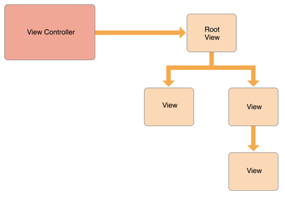
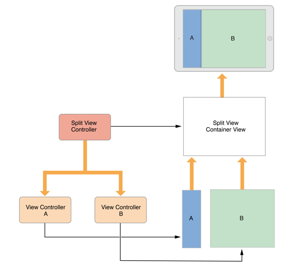

# The Role of View Controllers

모든 앱은 하나 이상의 View controller로 이루어져있다. View controller는 앱의 UI와 인터페이스, 데이터 간의 상호작용을 담당한다. View controller는 앱의 구조에서 아주 중요한 부분이며, 우리는 함수들과 프로퍼티, 변수들을 View controller에 선언한다. 이러한 View controller엔 두 가지 종류가 있다.

- Content View controller - 앱의 content 개별요소를 관리한다.
- Container View controller - 다른 View controller 로부터의 데이터를 모으며, 여러 데이터를 표시한다.

### View Management

View Management의 가장 중요한 역할은 View들의 계층 구조를 관리하는 것 이다. 모든 View controller 들은 유일한 root view를 가지며 그 root view에 표시할 데이터를 추가한다. 아래의 그림처럼, View controller는 항상 Root View를 가지며, 각각을 subview에 대한 강한 참조를 가진다.

View controller는 자신이 포함하는 view에대한 참조를 outlet 형태로 가진다.이 관계는 view가 스토리보드에서 로드 될 때 자동으로 연결된다.

Container View controller 는 자신이 가진 View들을 관리한다. 또한 자신과 자신의 자식 View controller에 대한 root views들을 관리한다. 자식 view들의 내부적인 내용은 관리하지 않는다. 사이즈, 위치설정을 위하여 root view만 관리한다. 

Split View controller는 자식 view들의 위치, 사이즐르 관리하며 자식 View controller 는 담길 내용들을 관리한다.

### Data Marshaling

View controller 는 관리한는 view와 data사이의 중계자 역할을 한다. 내부에 변수를 선언하고, 함수를 구현함으로서 데이터를 다룰 수 있다. 그 관계는 항상 깔끔하게 분리되어 있어야 한다. 이러한 구조의 무결성을 보장하는 논리는 데이터 객체가 담당한다. view는 데이터를 받아 인증과정을 거쳐, 데이터 객체의 알맞은 형태로 재조립한다. 실제 데이터 처리에서는 View controller 의 역할을 최소화 하여야 한다.

`UIDocument`를 활용하여 이를 구현할 수 있다. 이 객체는 데이터를 영구적으로 보관하는 방법을 가지고있다. 이 객체를 subclass하여,  여러 로직을 추가해서 데이터를 추출, View controller로 전송할 수 있으며 View controller 는 수신한 데이터를 저장하여 업데이트가 편리한 형태로 가공한다.

### User Interactions

View controller 는 반응형 객체이다. 이벤트를 관리하며 그 이벤트를  responder chain으로 전달한다.  실제론 가능하지만, 터치 이벤트는 직접 관리하지 않는 경우가 많다.  일반적으로, view들은 그들의 터치 이벤트를 관리하며, 처리한 결과를 delegate나 target object로 전송한다. 보통 그 대상이 View controller 이다. 그리하여, 보통 여러 이벤트들은 View controller의 delegate나 action method로 관리한다. 

### Resource Management

View controller는 자신이 생성한 객체에 대한 모든 책임을 가진다. 생성한 view 들과 관련된 데이터는 필요 없는 시점에 모두 해제되며, 이는 View controller 가 담당한다. 

가용할 수 있는 메모리가 적다면, UIKit은 앱에게 해제할 수 있는 자원을 해제하라고 요청한다. 이는 `didReceiveMemoryWarning`함수를 통하여 이루어진다. 

### Adaptivity

View controller 는 모든 view의 표현과 그 환경관리를 담당한다. 모든 iOS앱은 아이패드, 기타 여러 크기의 기기에서 실행될 수 있어야 한다. 각각 환경에서 다른 View controller 를 사용하기보단, 한 View controller가 여러 환경에 대응하는 방법이 좋다. 

View controller는 대단위 변경 및 미세 조정을 처리해야 한다. View controller의 특성이 변경될 때, 대단위 변경이 진행된다. 그 특성은 화면 크기와 같은 전반적인 환경을 의미한다. 가장 중요한 두 특성은 View controller의 가로, 세로 모드에서의 크기이다. size  class를 활용하여 변화에 대응할 수 있다. 

주어진 size class 에서 더 세분화된 변경이 발생할 수 있다. 이러한 조정엔 Auto Layout을 활용하여 효율적으로 대응할 수 있다.