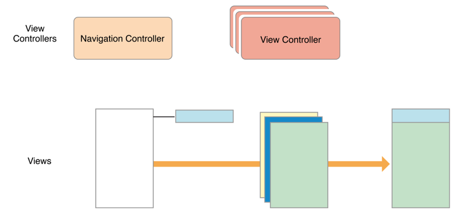
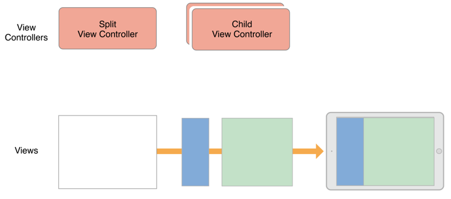
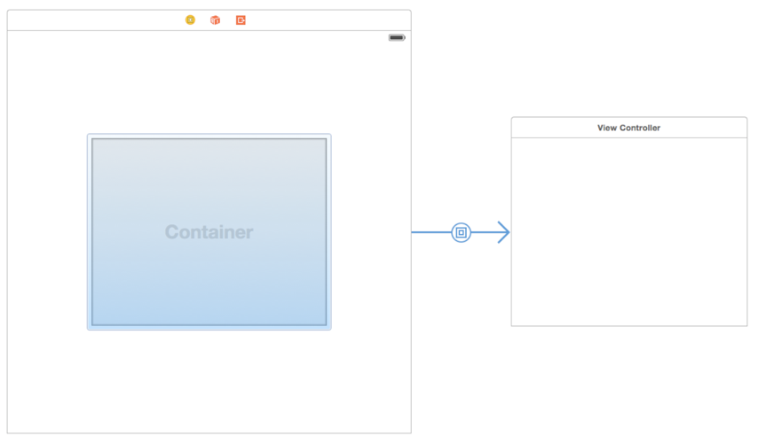

# Implementing a Container View Controller

Container View controller는 여러 View controller 의 내용을 하나의 UI로 결합한다. UIKit의 Container View controller 의 예로는 UINavigationController, UITabBarController 및 UISplitViewController가 있다.


### Designing a Custom Container View Controller

여러 측면에서, Container View controller는 루트뷰와 다른 컨텐츠를 관리하는 의미에서 다른  View controller와 동일한다. 차이점은, Container View controller는 그것의 컨텐츠를 다른  View controller에서 가져온다는 것 이다.  가져온 컨텐츠를 이용하여 표시하며, 그것의 계층구조에 포함시킨다. Container View controller는 삽입된  View controller를 알맞은 위치와 크기로 설정한다.

개발자가 자신의 Container View controller를 정의할때, Container와 Contained의 관계를 이해하여야 한다. 다음의 물음을 참고하자.

- Container의 역할은 무엇이고, 자식 뷰들의 역할은 무엇인가?
- 동시에 최대 몇개의 자식뷰가 보여지는가?
- 자식 View controller끼리의 관계는 어떠한가?
- 얼마나 많은 자식 View controller가 추가되거나 제거되는가?
- 자식 뷰들의 사이즈나 위치가 변경될 수 있는가? 어떠한 조건에서 변경되는가?
- Container가 내부에 추가적인 장식 또는 탐색과 관련된 뷰를 제공하는가
- Container와 자식 사이에서 어떠한 통신이 일어나는가? 
- Container의 모습을 다르게 구현할 수 있는가? 어떻게?

Container View controller의 구현은 다른 객체의 역할을 정의한 후 간단하게 진행할 수 있다. 요구되는 조건은 오직Container와 자식 사이에 관계 설정이다. 그 관계는 자식이 여러 시스템 메세지를 받는것을 의미한다. 그 외에도 실제 작업의 대부분은 컨테인드 뷰의 레이아웃과 관리 중에 발생하며 각 Container마다 다르다.  계층 구조에 다른 뷰를 추가하여 추가적인 기능을 제공할 수 있다.


### Example: Navigation Controller

Navigation Controller는 데이터를 계층 구조로 관리하며 Navigation을 제공한다. Navigation 인터페이스는 항상 하나의 자식뷰를 표시한다. 상단의 Navigation Bar가 현재 자식 뷰의 상태를 표시하며, Back 버튼을 활용하여 뒤로 이동할 수 있다. 

자식 뷰에서 특정 이벤트가 발생하면, Navigation Controller에게 새로운 View Controller를 push하라는 요청을 보낸다. 자식 뷰가 새로운 View Controller를 관리하며, Navigation Controller는 트랜지션을 담당한다. 



### Example: Split View Controller

UISplitViewController는  mater-detail의 형태로 두 View Controller 를 표현한다. View controller 를 배치하는 형식은 기기의 상태에 따라 다르다.  가로 환경에선, 두 View Controller 가 나란히 표시되며 Master는 숨기거나 필요할 때 표시될 수 있다. Compact 환경에선, 하나의 View Controller 만 표시된다.



### Configuring a Container in Interface Builder

 Container view를 활용하여 부모-자식 관계의 구조를 쉽게 구현할 수 있다. Container view는 부모 뷰에서 자식 뷰의 placeholder형태로 표시되며, 크기와 위치를 설정하여 자식 뷰를 구현할 수 있다. 이때 자식 뷰는 부모 뷰와 함께 초기화 되어야 한다.



### Implementing a Custom Container View Controller

Custom Container View controller 를 구현하기 위해선, 뷰 간에 부모-자식 관계를 설정하여야 한다.


### Adding a Child View Controller to Your Content

개발된 컨텐츠에 Child View controller 를 추가하기 위해선, 다음의 항목을 준수하여 부모-자식 관계를 형성하여야 한다.

- `addChildViewController`를 호출하여 부모 뷰가 자식 뷰를 관리함을 알린다.
- 자식 뷰의 Root 뷰를 Container 뷰 계층구조에 추가한다. 
- Constraints를 추가한다.
- `didMoveToParentViewController`를 활용한다.

그 과정은 다음예시를 참고할 수 있다.

```swift
func disPlayContentController(vc:UIViewController) {
  addChildViewController(vc) // call willMove
  vc.view.frame = view.frame
  view.addSubview(vc.view)
  vc.didMove(toParentViewController: self)// call didMove
}
```

addSubview로 view를 추가 후 ,`didMove(toParentViewController: self)`를 호출하여 자식 뷰의 `didMove(toParentViewController: self)`를 호출할 수 있다. 


### Removing a Child View Controller

다음 절차를 따르며, 생성된 자식 뷰를 제거할 수 있다.

- 자식 뷰의 `willMoteToParentViewController:`를 nil을 주어 호출한다.
- 자식 뷰에 대한 constraints를 제거한다.
- 자식 뷰의 루트 뷰를 계층 구조에서 제거한다.
- 자식 뷰의 `remoeFromParentViewController`를 호출하여 관계를 해제한다.

```swif
func hideContentController(vc:UIViewController) {
  vc.willMove(toParentViewController: nil)
  vc.view.removeFromSuperview()
  vc.removeFromParentViewController()
}
```


### Transitioning Between Child View Controllers

```swift
func transitionVC(oldVC: UIViewController, newVC: UIViewController) {
        oldVC.willMove(toParentViewController: nil)
        addChildViewController(newVC)
        
        newVC.view.frame = startFrame
        let endFrame = oldVC.view.frame
        
        transition(from: oldVC, to: newVC, duration: 0.25, options: UIViewAnimationOptions.curveLinear, animations: {
            newVC.view.frame = oldVC.view.frame
            oldVC.view.frame = endFrame
        }) { (finish) in
            oldVC.removeFromParentViewController()
            newVC.didMove(toParentViewController: self)
        }
    }
```


### Managing Appearance Updates for Children

Containter에 자식을 추가한 후, 자동으로 자식들에게 생성과 관련된 메세지를 전송한다. 이는 `shouldAutomaticallyForwardAppearanceMethods`함수를 통하여 수신 설정이 가능하다. 

만약 트랜지선이 발생한다면, 적절한 시기에 자식의 `beginAppearanceTransition:animated:` 나 `endAppearanceTransition`를 호출하여야 한다. 

- `beginAppearanceTransition(isAppearing: Bool, animated:)`
- `endAppearanceTransition()`

위의 함수들로 자식 뷰의 생성과  제거에 대한 메세지를 전송할 수 있다.


### Suggestions for Building a Container View Controller

새로운 Container View controller을 개발, 디자인, 테스트 하는 비용은 상당하다. 다음 항목을 참고하여 도움을 얻자.

- 자식 View controller의 루트 뷰에만 접근한다. - 다른 View에는 접근하지 않는다.
- Child View controller 는 Container에 대한 최소한의 참조만 갖는다. - 자식 뷰에서 Container로 영향을 주고 싶다면, delegate 패턴을 사용한다.
- 일반적인 View로 Container를 설꼐하라. - 애니메이션,  Layout 테스트의 이점을 가져올 수 있다.
- ​

### Delegating Control to a Child View Controller

Container는 자신의 일부 특성을 자식 뷰에게 권한을 위임할 수 있다.

- 자식 뷰가 Statuc bar style을 결정한다. - `childViewControllerForStatusBarStyle` ,`childViewControllerForStatusBarHidden` 로 구현할 수 있다.
- 자식 뷰가 특정 사이즈를 갖는다. - 유동적 사이즈를 갖는 Container 내의 자식 뷰라면, `preferredContentSize` 를 활용하여 적절한 사이즈를 찾을 수 있다.