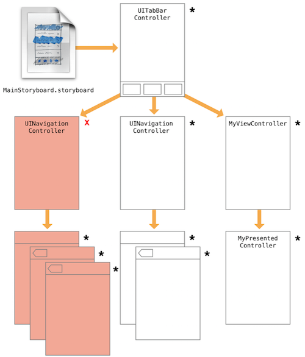

# Preserving and Restoring State

View controller는 상태 보존과 복원에 중요한 역할을 한다. 상태 저장, 복구의 과정에서 개발자는 iOS에게 App내에서 적용할 부분에 대한 정보를 주어야 한다. View Controller의 상태를 저장하는 방법은 다음과 같다.

- restoration ID를 할당한다.
- launch time에 어떤 방법으로, 어느 위치에 View controller를 생성할지 설정한다.
- 각 View Controller에서, 복원에 필요한 특정 데이터를 저장한다.


### Tagging View Controllers for Preservation

UIKit은 개발자가 지정한 View controller 만을 저장한다. 각 View Controller는 restoration ID를 가지고 있으며, 기본값은 nil이다. 유효한 값을 할당함으로써, 저장하도록 할 수 있다. 유의할 점은, restoration ID를 저장할 때, 부모 View Controller 또한 restoration ID를 지정하여야 한다. 


### Choosing Effective Restoration Identifiers

restoration ID는 간단하게 식별 가능한 값을 지정하여야 한다. 보통 View Controller 의 클래스 명으로 지정한다. 모든 View Controller 의 restoration ID는 unique하여야 한다. `UINavigationController`의 경우, View Stack 에 따라 자동으로 restoration ID를 부여한다. 


### Excluding Groups of View Controllers

일정 View Controller의 그룹을 복원 과정에서 제외하고 싶다면, restoration ID의 값을 nil로 지정하여야 한다. 




하나 또는 많은 수를 제외하더라도, 복원 가정에서 전체가 제외되진 않는다. 앱이 구동되는 시점에 기본으로 설정된 View Controller의 경우 복원된다. 이러한 자동 복원에서 제외시키더라도, 수동으로 복원을 설정할 수 있다. 복원 아카이브에서 View Controller에 대한 참조를 저장한다면, 상태가 저장된다. 


### Preserving a View Controller’s Views

 일부 View는 상위 View와는 관계 없는 고유한 특성을 가진다. 예로, scrollView의 경우 스크롤 위치를 저장할 수 있다. View controller 가 ScrollView의 컨텐츠를 제공하는 동안, ScrollView는 시각적인 상태를 복원하여야 한다. 그 방법은 다음과 같다.

-  `restorationIdentifier` 를 지정한다.
-  restoration ID를 가진 View controller 의 View를 사용한다.
-  table,collection View  의 경우, `UIDataSourceModelAssociation`를 dataSource에 적용한다.


### Restoring View Controllers at Launch Time

앱이 시작하는 시점에, 이전의 상태를 복원하려 한다. UIKit은 다음의 순서로 View controller 를 찾아 배치한다.

1. restoration class가진 View Controller라면, 그 class에게 View controller 를 요구한다.
   - `viewControllerWithRestorationIdentifierPath:coder:`  를 호출하여 View controller 를 가져온다. nil을 반환한다면, 재생성을 원하지 않는 것으로 판단한다.
2. App Deleagete에게 View Controller 객체를 요청한다.
   - UIKit은 `application:viewControllerWithRestorationIdentifierPath:coder:` 를 호출하여 View Controller 를 찾는다. nil을 반환한다면, 암묵적으로 탐색을 진행한다.
3. restoration path를 가진다면, 그 객체를 사용한다. 
4. View Controller 가 StoryBoard에서 생성되었다면,  저장된 Storyboard객체를 활용하여 생성, 배치한다. 


View Controller 에게 복원 객체를 추가하여, UIKit이 암묵적인 탐색을 진행하는걸 막을 수 있다.  또한 객체의 복원을 원하는지, 원하지 않는지 분명히 알릴 수 있다. 복원 객체를 사용할 때,   `viewControllerWithRestorationIdentifierPath:coder:`  함수는 View Controller를 생성하고, 최소한의 초기화를 거쳐 반환하여야 한다. 

다음은 Storyboard를 사용하는 환경에서, 복원을 진행하는 예제이다. 

```swift
static func viewController(withRestorationIdentifierPath identifierComponents: [Any], coder: NSCoder) -> UIViewController? {
        let vc: UIViewController
        let sb = coder.decodeObject(forKey: UIStateRestorationViewControllerStoryboardKey) as? UIStoryboard
        if let storyBoard = sb {
            vc = storyBoard.instantiateViewController(withIdentifier: "vc") as! UIViewController
            vc.restorationIdentifier = identifierComponents.last
            vc.restorationClass = vc.restorationClass
        }
        return vc
    }
```


### Encoding and Decoding Your View Controller’s State

저장의 과정에서, UIKit은 객체의 `encodeRestorableStateWithCoder:`를 호출하여 저장의 기회를 준다. 복원의 과정에서 `decodeRestorableStateWithCoder:`를 호출하여 저장된 객체를 디코딩한다. 이 두 함수의 구현은 선택적이며, 다음의 정보를 담고 있다면, 권장된다. 

- 표시되는 데이터에 대한 참조
- Container View controller에서  자식 뷰에 대한 참조
- 현재 선택에 대한 상태
- 사용자 설정 이나 현재 설정의 내용을 담는 View를 포함하는  View controller


### Tips for Saving and Restoring Your View Controllers

- 모든 View Controller를 저장할 필요는 없다.
- 복원 시점에 View Controller를 교체하는 것은 피하라.
- View Controller의 저장을 의도에 맞게 사용하라.


